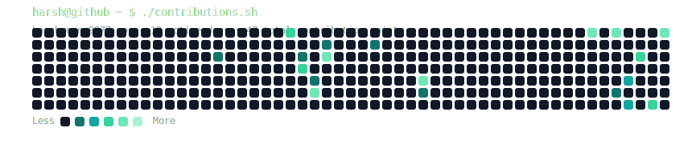
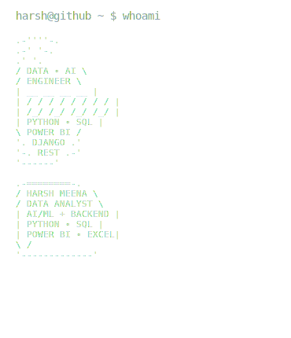

# Hi, I'm Harsh Meena 👋

### Data Analyst • AI/ML Enthusiast • Python Backend Developer

I build data-driven solutions using **Python, SQL, Power BI, and Django** — from analyzing business datasets to developing production-ready REST APIs.

📊 **5+ End-to-End Projects** · 📈 **22,000+ Records Analyzed** · 🐍 **Python & SQL**

<h3><code>harsh@github ~ $ ./contributions.sh</code></h3>

  

<h3><code>harsh@github ~ $ whoami</code></h3>

<table>
<tr>
<td valign="top">

</td>

<td valign="top">

</td>
</tr>
</table>

 

<h3><code>harsh@github ~ $ ./projects.sh</code></h3>

---

## 📊 Featured Projects

### 🔥 Telecom Churn Analysis & Retention Strategy

**Python · SQL · Power BI**

* Analyzed 7,043 customer records
* Identified high-risk churn segments
* Built retention-focused KPI dashboard
* Transformed raw customer data into actionable business insights

---

### 📈 Global Superstore Sales Analytics

**Python · SQL · Power BI**

* Analyzed 10,000+ sales transactions
* Evaluated sales, profit, margin, and regional performance
* Built an interactive business intelligence dashboard
* Identified low-profit product segments

---

### 🚚 Vendor Performance Optimization

**SQL · Power BI**

* Analyzed 5,000+ vendor transaction records
* Measured On-Time Delivery and Defect Rate KPIs
* Identified vendors contributing to delivery delays
* Built an operational performance dashboard

---

### 🏥 MediConnect Pro

**Python · Django · Django REST Framework · PostgreSQL**

Production-ready healthcare appointment booking REST API.

* Authentication and user management
* Healthcare appointment workflow
* RESTful API architecture
* PostgreSQL database integration

---

<h3><code>harsh@github ~ $ cat skills.txt</code></h3>

### Languages & Analytics

`Python` · `SQL` · `Pandas` · `NumPy`

### Business Intelligence

`Power BI` · `DAX` · `Power Query` · `Excel`

### Backend Development

`Django` · `Django REST Framework` · `REST APIs`

### Databases & Tools

`MySQL` · `PostgreSQL` · `Git` · `GitHub`

 

<h3><code>harsh@github ~ $ ./connect.sh</code></h3>

Open to opportunities in:

**Data Analytics · Business Intelligence · AI/ML · Python Backend Development**

