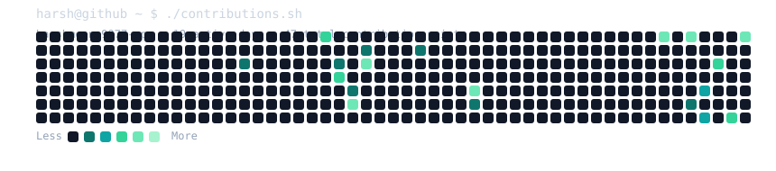
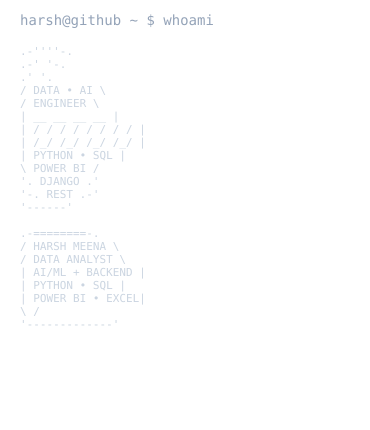

<div align="center">

# Hi, I'm Harsh Meena 👋

### Data Analyst • Business Analyst • BI & Reporting

I turn raw data into decisions using **SQL, Python, Power BI, and DAX** — from exploring business datasets to building recruiter-ready dashboards with real, quantified insights.

📊 **5+ End-to-End Projects** · 📈 **170,000+ Records Analyzed** · 🐍 **SQL, Python & Power BI**

<p>
  <a href="https://www.linkedin.com/in/harsh-meena-analyst">
    LinkedIn
  </a>
  &nbsp; • &nbsp;
  <a href="mailto:harshmeena9977@gmail.com">
    Email
  </a>
</p>

</div>

---

## 📌 My Best Work (Recommended First Look)

- [Global-Superstore-Sales-Analysis](https://github.com/harshmeena9977-ops/Global-Superstore-Sales-Analysis) — 10,000+ transactions across 50+ countries; identified a 25% discount threshold that prevents margin erosion.
- [Telecom-Churn-Analysis](https://github.com/harshmeena9977-ops/Telecom-Churn-Analysis) — 7,043 customer records; built a churn model (85.3% accuracy) and retention strategy for a ~26.5% at-risk segment.
- [yelp-restaurant-success-metrics](https://github.com/harshmeena9977-ops/yelp-restaurant-success-metrics) — 150K+ restaurants, 2M+ reviews; surfaced a "rating vs. volume" engagement gap and 7 strategic recommendations.
- [Hypothesis-Testing-Discount-Impact](https://github.com/harshmeena9977-ops/Hypothesis-Testing-Discount-Impact) — statistical validation (paired t-test, Cohen's d) of discount strategy impact on sales.

---

<div align="center">

<h3><code>harsh@github ~ $ ./contributions.sh</code></h3>



<br><br>

<h3><code>harsh@github ~ $ whoami</code></h3>

<table>
<tr>
<td valign="top">

</td>

<td valign="top">

</td>
</tr>
</table>

</div>

---

<div align="center">

<h3><code>harsh@github ~ $ cat skills.txt</code></h3>

</div>

## 🧰 Technical Stack

### Business Intelligence & Analytics

`Power BI` `DAX` `Power Query` `SQL` `Storytelling` `KPIs` `Excel`

### Data Science

`Python` `Pandas` `NumPy` `Statistical Testing` `Scikit-learn`

---

<div align="center">

<h3><code>harsh@github ~ $ ./what-i-do.sh</code></h3>

</div>

```text
→ Transform raw data into actionable insights
→ Build analytical dashboards for business decisions
→ Write SQL queries for data exploration and KPI analysis
→ Develop Python-based data workflows
→ Apply statistical testing to validate business decisions
```

---

<div align="center">

<h3><code>harsh@github ~ $ ./currently-learning.sh</code></h3>

</div>

```text
[████████████████████] SQL
[██████████████████░░] Power BI
[██████████████████░░] Python
[████████████████░░░░] DAX & Data Modeling
[████████████░░░░░░░░] Statistical Analysis
[███████████░░░░░░░░░] Machine Learning
```

---

<div align="center">

<h3><code>harsh@github ~ $ ./career.sh</code></h3>

</div>

I am actively looking for opportunities in:

**Data Analytics · Business Analysis · Business Intelligence · MIS & Reporting**

I enjoy solving problems where **data, business context, and clear communication intersect**.

---

<div align="center">

<h3><code>harsh@github ~ $ ./connect.sh</code></h3>

</div>

📧 **[harshmeena9977@gmail.com](mailto:harshmeena9977@gmail.com)**

💼 **[Connect with me on LinkedIn](https://www.linkedin.com/in/harsh-meena-analyst)**

<br>

⭐ If you find my projects useful, feel free to explore the repositories.

<br>

**BUILDING • LEARNING • SHIPPING**

</div>

<!-- GitHub stats -->

<p align="center">
  
  
</p>
